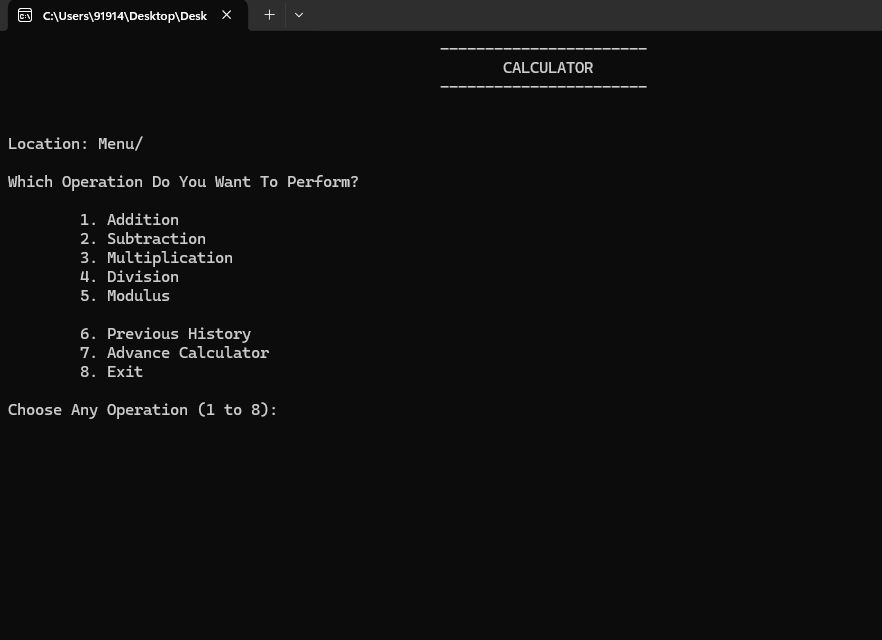
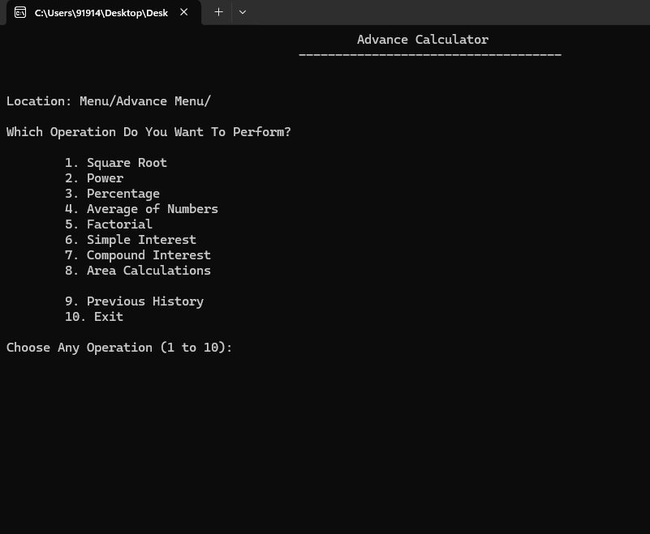

# 🧮 C Terminal-Based Calculator

Welcome to the **C Terminal-Based Calculator Project**, a comprehensive menu-driven application developed in the **C programming language**. This calculator not only supports **basic arithmetic** but also includes a full suite of **advanced mathematical operations**, **history tracking**, and **modular menus** for smooth user experience.

---

## 📌 Project Overview

This calculator is designed to run entirely in the terminal (command-line interface) and includes:

- Interactive Menus
- Modular Operation Handling
- Operation History
- Both Simple & Advanced Calculations
- Clean User Experience Flow

---

## ✨ Features Breakdown

### 🔢 Basic Operations
- ✅ Addition
- ✅ Subtraction
- ✅ Multiplication
- ✅ Division
- ✅ Modulus

### 🧮 Advanced Operations
- √ Square Root
- ^ Power (Exponentiation)
- % Percentage Calculation
- ∑ Average of Multiple Numbers
- ! Factorial Calculation
- 💰 Simple Interest
- 💸 Compound Interest
- 📏 Area Calculations (Circle, Rectangle, Triangle, etc.)

### 📜 History Functionality
- Shows the list of previously performed operations.
- Tracks both basic and advanced calculations.

### 🔁 Second Menu System
After every operation, the user can choose to:
- Continue with the same operation
- Go back to the main menu
- View calculation history
- Exit the program

---

## 🚀 Getting Started

### 🧑‍💻 Prerequisites
Ensure you have a C compiler installed. Recommended: `gcc`

### 🛠️ How to Compile
```bash
gcc calculator.c -o calculator -lm
```
> `-lm` links the math library (required for functions like `sqrt()` and `pow()`).

### ▶️ How to Run
```bash
./calculator
```

---

## 🗂️ Project Structure

```
📁 C-Calculator-Project/
│
├── calculator.c        # Core calculator source code
├── calculator.exe      # Compiled executable file (Windows)
├── color.h             # Color macros/header for UI styling, bg color, text color
├── README.md           # Project documentation
└── assets/             # Screenshots or related media

```

---

## 📸 Sample Screenshots

<div align="center">   </div>


### Main Menu Interface
```
                ----------------------- 
                       CALCULATOR
                -----------------------

Location: Menu/

Which Operation Do You Want To Perform?

 1. Addition
 2. Subtraction
 3. Multiplication
 4. Division
 5. Modulus
 6. Previous History
 7. Advance Calculator
 8. Exit
```

### Advanced Menu Example
```
                Advance Calculator
            ----------------------------

Location: Menu/Advance Menu/

Which Operation Do You Want To Perform?

 1. Square Root
 2. Power
 3. Percentage
 4. Average of Numbers
 5. Factorial
 6. Simple Interest
 7. Compound Interest
 8. Area Calculations
 9. Previous History
10. Exit
```


## 🤝 Contribution Guidelines

Want to improve this project? Feel free to contribute!

### Steps:
1. 🍴 Fork the repository
2. 🔧 Create your branch: `git checkout -b feature-name`
3. 📝 Commit your changes: `git commit -m "Add feature"`
4. 🚀 Push to the branch: `git push origin feature-name`
5. 🔁 Open a Pull Request

---

## 👤 Author

**Md Sonu & Danish Farhan**  
🎓 BCA Student at Arya Bhat Knowledge University  
💼 Aspiring Full Stack Developer  
🔗 GitHub: [@md-sonu07](https://github.com/md-sonu07)

---

## 📜 License

This project is licensed under the **MIT License**.  
Feel free to use, modify, and distribute it for learning and development purposes.

---

## 💬 Feedback

Have suggestions or found a bug?  
Open an [issue](https://github.com/md-sonu07/C-Programs/issues) or contact me directly!

